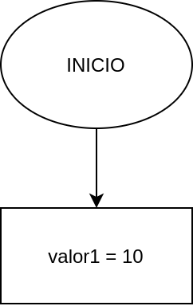
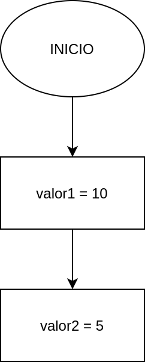
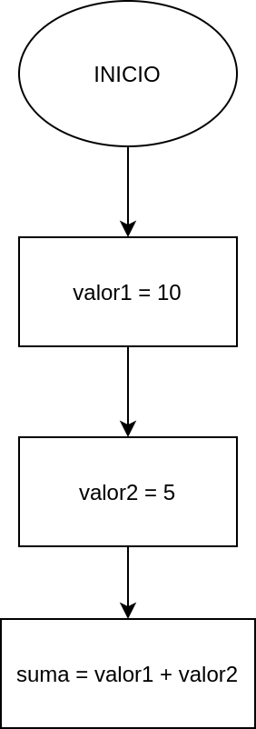
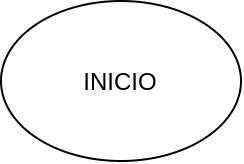
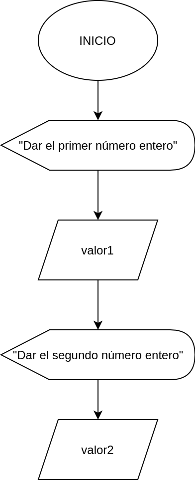

# 1.4 Introduccion a creacion de Diagrmas de flujo

Aqui comenzaremos a construir diagramas de flujo basicos. Construidos parte por parte.

**1. Se debe realizar un diagrama de flujo que sume 2 numeros enteros, estos numeros deben estar almacenados en memoria; es decir, en variables. El resultado enviarlo a la pantalla.**

Con base a las instrucciones, entendemos que los valores pueden ser cuales quiera, deben estar almacenados en el programa.

Primero debemos comenzar con el simbolo de *INICIO*

Tomando las instrucciones nos dice que debemos tomar definir un valor, el que nosotros querramos, en memoria para sumarlo con otro, por lo tanto, aplicamos un proceso declarando la primera variable `variable1` y le asignamos un valor; en esta caso le asignamos el valor de `10`. El simbolo de `Proceso` (Rectangulo) se usa para realizar una operacion matematica, asignacion de valor a una variable o declaracion de una variable.

*Se utiliza el signo de igual (=) para asignacion de un valor a una variable.*

Ahora debemos declarar otro variable, en este caso la llamaremos `valor2`, recordemos que el nombre de la variable es el que escojamos. *En una seccion previa se indican las reglas para declaracion de variables*.
A nuestra variable `variable2` le asignamos el valor de `5`. Como estamos realizando una asignacion de un valor a una varialbe, utilizamos el simbolo de `Proceso` (Rectangulo).

Acto seguido es realizar la operacion aritmetica de suma. Para ello esto lo realizamos en un `Proceso` y lo guardamos en una variable llamada `suma`.

Ya que tenemos el resultado guardado en la variable `suma`, lo mandaremos a la pantalla (Display).

Hemos terminado de realizar lo solicitado, por lo tanto, debemos terminar nuestro diagrama de flujo, con el simbolo de `FIN`

**2. Realizar la suma de dos números enteros, solicitandolos al usuario y al final imprimir por pantalla el resultado.**

Con base a las instrucciones debemos solicitar al usuario los números, pero primero le tenemos que indicar que debe hacer, y debemos guardar este valor en una variable cada uno para poder realizar la operación correspondiente.

Como todo diagrama de flujo comenzamos con el símbolo de *INICIO*

Tenemos que indicarle al usuario qué debe realizar, para realizar esto debemos utilizar el simbolo para enviar mensajes a la pantalla con el mensaje. *Los textos que queremos que se muestre debe ir entre doble comilla `" "`*. El mensaje que mostraremos es `"Dar el primer número entero"`

Ahora debemos recibir el dato que el usuario quiere ingresar, este número lo debemos guardar en algun lado, por lo tanto, declaramos una variable dentro del símbolo que es para ingresar datos. La variable la llamamos `variable1`

Ya que tenemos el primer valor, debemos solicitar al segundo valor, para ello debemos mandar el segundo mensaje indicandole al usuario qué debe realizar, el mensaje será `"Dar el segundo número entero"` dentro del símbolo de `Display`

Debemos recibir el siguiente valor y almacenarlo en otra variable, la llamaremos `valor2`, para poder ingresar el valor a esta variable tenemos que ocupar el símbolo de entrada de datos.

Contamos con los valores que ingreso el usuario en las variables `valor1` y `valor2`, ahora debemos realizar la operación y la guardaremos en la variable `suma`.

El resultado de la operación esta almacenada en la variable `suma`, la debemos envíar a la pantalla, tenemos que usar el símbolo de `Display`, la variable

Hemos terminado lo que nos fue solicitado, por lo tanto, solo nos queda finalizar el diagrama de flujo con *FIN*

Realizado por Docente: [Alejandro Leyva](https://www.alejandro-leyva.com/)

[Mecatrónica 85](https://mecatronica85.com/)

[fb/mecatronica85](https://www.facebook.com/mecatronica85)
